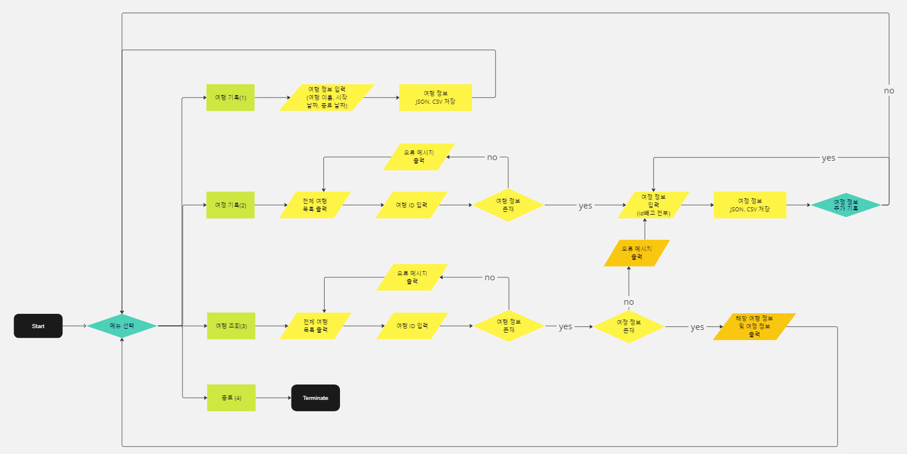

# 토이 프로젝트1 : 여행 여정을 기록과 관리하는 SNS 서비스 1단계

---

## 📌 목차

- [설정](#설정)
- [일정](#일정)
- [멤버](#멤버)
- [설계](#설계)
- [개발 내용](#개발-내용)
- [UI 화면 구상도](#ui-화면-구상도)

---

## 설정

- 자바 버전: 17
- 의존성
    - gson 2.10.1
    - lombok:1.18.28
    - junit-bom:5.9.1
    - junit-jupiter

---

## 일정

- 프로젝트 기간: 2023-09-04~ 2023-09-10

---

## 멤버

- 👩🏻‍💻 [정의정](https://github.com/JeongUijeong)
- 👩🏻‍💻 [양유림](https://github.com/YurimYang)
- 👩🏻‍💻 [강민정](https://github.com/ypd06021)
- 👨🏻‍💻 [조병상](https://github.com/jojojojocho)
- 👩🏻‍💻 [이의인](https://github.com/dldmldlsy)

---

## 설계

### Flow Chart

> 

---

## 개발 내용

- 여행 및 여정 정보 기록기능
    - 여행일정을 기록해야 한다.
    - 하나의 여행에 여러 개의 여정 정보를 기록해야 한다.
    - 여정 정보를 N개 입력 후 계속 기록 여부를 묻고(Y/N) 기록을 종료 할 수 있다.
- 여행 및 여정 조회 하는 기능
    - 여행 전체 리스트를 조회 할 수 있어야 한다.
    - 여행 전체 리스트에서 확인된 여행 아이디를 입력하면 해당 여행 정보와
      여정 정보를 조회 할 수 있어야 한다.
    - 여행정보와 여정 정보 조회는 JSON 파일에서, CSV 파일에서 각각 조회가
      가능해야 한다.
- 예외처리
    - 여행 정보가 없으면 오류 메시지를 출력한다.
    - 여행에 여정이 없으면 추가할 수 있어야 한다.
    - JSON, CSV 형식에 맞지 않으면 오류 메세지를 출력한다.
    - 한글 문자가 깨지지 않도록 해야 한다.

---

## UI 화면 구상도

추후 추가 예정